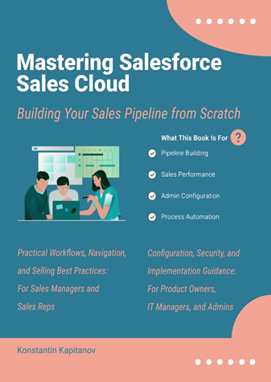

# Mastering-Salesforce-Sales-Cloud
A two-part guide: practical sales workflows followed by configuration, administration, and governance.

First Edition 2026 (Color illustrations)

Whether you're leading a sales conversation or configuring the system behind the scenes, this book helps you take control of Salesforce Sales Cloud confidently, clearly, and with impact.

Who This Book is for:

For Sales Managers and Sales Reps: Learn how to build and manage your pipeline, qualify leads, and close deals faster using Salesforce Sales Cloud. Discover how to navigate the platform efficiently, track performance with dashboards and reports, and apply proven sales strategies that boost productivity and revenue.

For Product Owners, IT Managers, and Admins: Get step-by-step instructions for customizing Salesforce Sales Cloud to fit your business needs. From object setup and user permissions to automation and integration, this book helps you implement scalable, secure, and efficient CRM solutions tailored to your organization.

ISBN 978-91-531-6543-9 (Print)

ISBN 978-91-531-6544-6 (EPUB)

ISBN 978-91-531-6680-1 (PDF)
